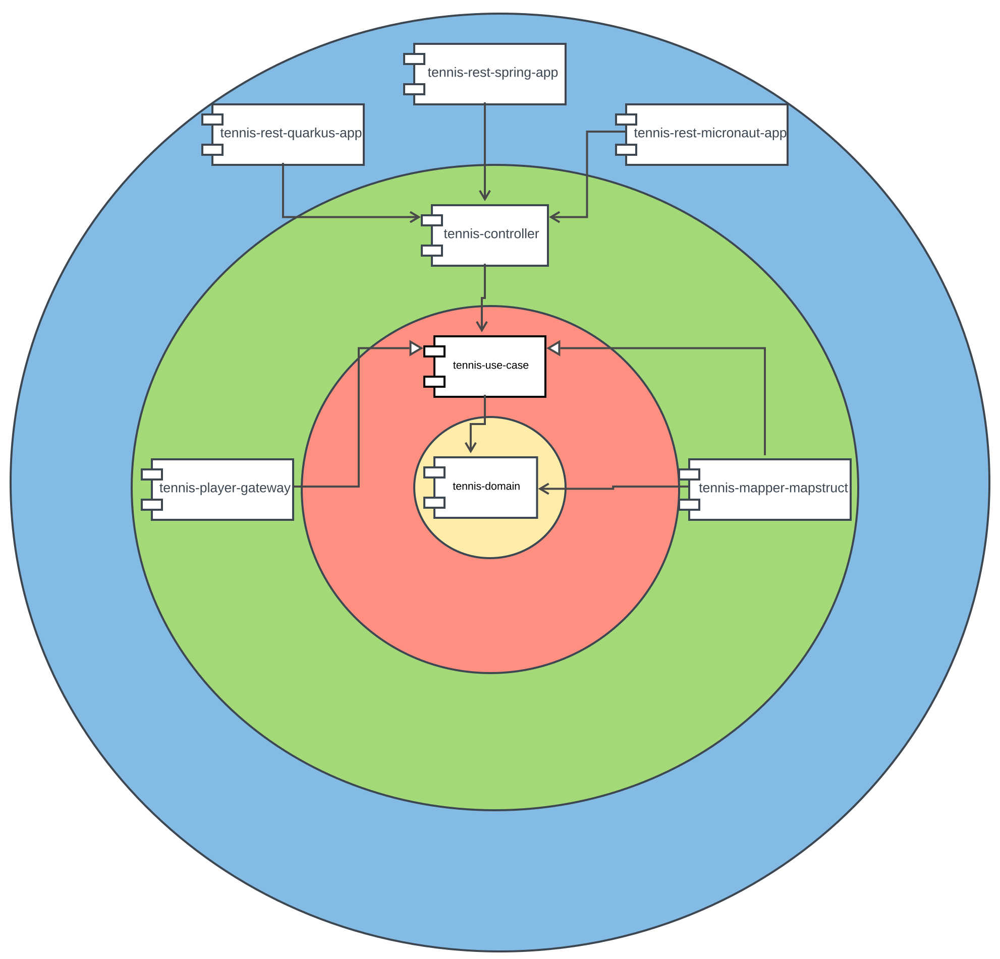

# simulateur-match-tennis 

[](https://travis-ci.com/Sims07/simulateur-match-tennis)

### Goals

The goals of this project is to be able to change of microservice frameworks without impacting the core of the application.
To do that we will use an adaptation of the clean architecture.

### Realisation

We put all microservice frameworks's codes and dependencies in the outermost layer. 
The apps in this outer layer contain a "main" method and so have access to all the modules to make the glue code.

To ensure dependency rules inward and prevent access from adapter layer to domain model we will use the modules of java 9.

We use clean architecture boundary to protect the core of our application of framework.

To simplify the architecture and stay focused only on the isolation of microservice framework we decide 
- to remove the tennis presenter
- to use a no mapping strategy for adapter layer and directly return the use-case's model in the controller.

We use bi-directional binding between use case's model and domain's model.
The mapper framework is put on the upper layer to let the business rules framework independent. 



#### Microservice Frameworks

##### App Configuration

The glue code used to start the application is different for each of the frameworks.
We want a non intrusive configuration and isolate it in the outer most layer (no annotation on the code in inward layers).

##### App Configuration with Spring

With spring we can use the non intrusive java based configuration.

```java
@Configuration
public class AppConfig {

    @Bean
    public TennisMatchSimulatorController tennisMatchSimulatorController(SimulateTennisMatchUseCase simulateTennisMatchUseCase) {
        return new TennisMatchSimulatorControllerImpl(simulateTennisMatchUseCase);
    }
    ...
}
```

##### App Configuration with Quarkus

We use a quarkus adapter for spring DI which enable the use of the same configuration file.

##### App Configuration with Micronaut

Micronaut uses its own annotation to create factories.

```java
@Factory
public class AppConfig {

    @Singleton
    public TennisMatchSimulatorController tennisMatchSimulatorController(SimulateTennisMatchUseCase simulateTennisMatchUseCase) {
        return new TennisMatchSimulatorControllerImpl(simulateTennisMatchUseCase);
    }

    ...
}
```

##### Rest Service

All microsevices framework have their own way to create a rest service with different annotations.
Spring MVC and Micronaut use their own annotation and Quarkus is based on JAX-RS.
Furthemore they rely on different implementations of reactive library (RxJava for Quarkus, Reactor for Spring and both for Micronaut).

That's why we choose to put the REST implementation in the outermost layer and not in the adapter layer.
The controller in the adapter layer only delegates the call to the use case.

##### Rest Service with Quarkus
```java
@Path("/tennisMatchSimulation")
public class TennisMatchSimulatorRestController {

    private final TennisMatchSimulatorController tennisMatchSimulatorController;

    public TennisMatchSimulatorRestController(TennisMatchSimulatorController tennisMatchSimulatorController) {
        this.tennisMatchSimulatorController = tennisMatchSimulatorController;
    }

    @GET
    @Produces("text/event-stream")
    public Flowable<TennisScoreModel> simulateMatch() {
        return RxJava2Adapter.fluxToFlowable(tennisMatchSimulatorController
                                                .simulateTennisMatch(2)
                                                .delayElements(Duration.of(100, ChronoUnit.MILLIS)));
    }
}
```
##### Rest Service with Micronaut:
```java
@Controller("/tennisMatchSimulation")
public class TennisMatchSimulatorRestController {

    private final TennisMatchSimulatorController tennisMatchSimulatorController;

    public TennisMatchSimulatorRestController(TennisMatchSimulatorController tennisMatchSimulatorController) {
        this.tennisMatchSimulatorController = tennisMatchSimulatorController;
    }

    @Get(produces = MediaType.TEXT_EVENT_STREAM)
    public Flux<TennisScoreModel> tennisMatchSimulation() {
        return tennisMatchSimulatorController
                .simulateTennisMatch(2)
                .delayElements(Duration.of(100, ChronoUnit.MILLIS));
    }

}
```
##### Rest Service with Spring :
```java
@RestController
@RequestMapping("/tennisMatchSimulation")
public class TennisMatchSimulatorRestController {

    private final TennisMatchSimulatorController tennisMatchSimulatorController;

    public TennisMatchSimulatorRestController(TennisMatchSimulatorController tennisMatchSimulatorController) {
        this.tennisMatchSimulatorController = tennisMatchSimulatorController;
    }

    @GetMapping(produces = MediaType.TEXT_EVENT_STREAM_VALUE)
    public Flux<TennisScoreModel> tennisMatchSimulation() {
        return tennisMatchSimulatorController
                .simulateTennisMatch(2)
                .delayElements(Duration.of(100, ChronoUnit.MILLIS));
    }

}
```
