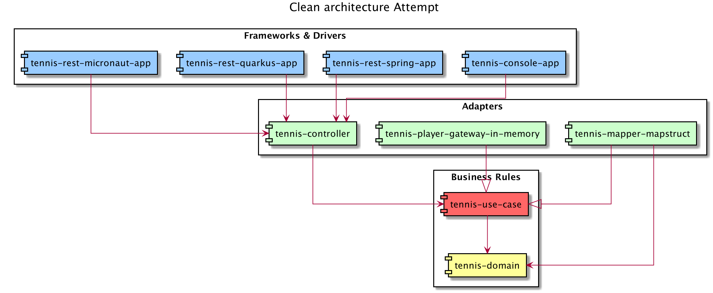

# simulateur-match-tennis 

### Goals

The goals of this project is to be able to change of microservice frameworks without impacting the core of the application.
To do that we will use an adaptation of the clean architecture.

### Realisation

We put all microservice frameworks's codes and dependencies in the outermost layer. 
The apps in this outer layer contain a "main" method and so have access to all the modules to make the glue code.

To ensure dependency rules inward this layer we will use the modules of java 9.

We use clean architecture boundary to protect the core of our application of framework.

To simplify the architecture and stay focused only on the isolation of microservice framework we decide 
- to remove the tennis presenter
- to use a no mapping strategy for adapter layer and directly return the use-case's model in the controller.

